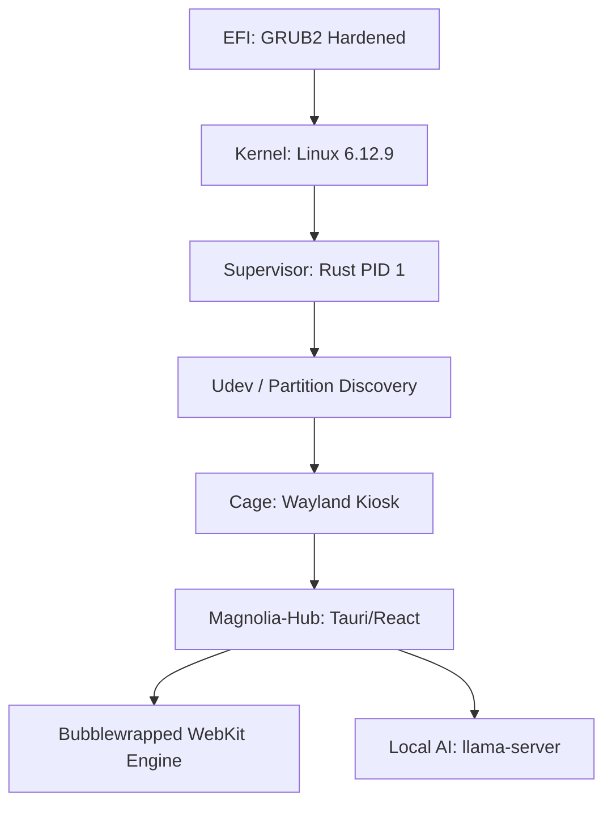

# 🌸 Magnolia OS: The Sovereign Intelligent Workspace


# Magnolia OS: The Sovereign Computing Manifest

Magnolia OS is a high-performance, privacy-first operating system designed for the era of personal autonomy. Built on a hardened Linux 6.12.9 foundation, it decouples the user from centralized surveillance through local-first intelligence and hardware-level isolation.

> *"Computed in Private. Verified by You. Sovereign by Design."*

---

## 🌸 The Sovereign Pillars

### 1. Radical Privacy
Magnolia operates under a **Zero-Leak Policy**. Every application is sandboxed in an ephemeral Bubblewrap namespace, with strictly audited filesystem and network access. Your telemetry is nonexistent, and your encryption is local.

### 2. Native Cloud Fusion
While we champion local first, we recognize the power of the heavy cloud. **Cloud Fusion** allows sub-millisecond integration with Google Cloud and Vertex AI via secure, Service Account-based authentication, ensuring your AI workloads are powerful but your identity remains sovereign.

### 3. Resilience Architecture (Stage A/B)
Magnolia uses a dual-root strategy to ensure the system never breaks. System updates target the inactive partition (`Stage A` or `Stage B`), allowing for seamless rollbacks if a kernel update fails.

---

## 🛠 Project Architecture



### Core Components
- **The Supervisor (PID 1)**: A dedicated Rust binary responsible for mounting decrypted persistent volumes (`vda4`/`vda5`) and initializing the Wayland compositor.
- **The Hub (Core)**: A Tauri-based system controller managing hardware abstraction, AI inference, and window management.
- **MemPalace**: An ultra-fast local RAG (Retrieval-Augmented Generation) engine for indexing your files privately.

---

## 📈 Feature Matrix (v1.0 Baseline)

| Feature | Status | Technology |
| :--- | :--- | :--- |
| **Stage A/B Boot** | ✅ Stable | GRUB2 / GPT Mapping |
| **App Sandboxing** | ✅ Stable | Bubblewrap / namespaces |
| **Magnolia Assistant** | ✅ Beta | llama.cpp / Local Inference |
| **Cloud Fusion** | 🛠 Alpha | GCP / Vertex AI Integration |
| **MemPalace Search** | 🛠 Alpha | Vector DB / Local Indexing |
| **i18n Support** | ✅ Stable | Hot-swappable JSON locales |

---

## 🚀 Getting Started

### Windows (WSL2 / Development)
1. Ensure `WSLg` is active.
2. Run `scripts/test_wsl_qemu.sh` to launch the Magnolia Simulation.

### Bare Metal (Target)
1. Flash `magnolia.img` to a high-speed NVMe or USB 3.0 drive.
2. Boot via UEFI. Ensure Secure Boot is configured in 'Audit Mode' for the initial flight.

---

## 💬 Human-Oriented Support
Magnolia includes an integrated **Sovereign Assistant**. Use the `/help` command or speak naturally to learn about system internals, adjust privacy settings, or troubleshoot network lattice issues.

---

*Magnolia is more than an OS. It is a commitment to digital self-determination.*

### How to Compile
You can compile the system into a flashable `.img` immediately by executing the overarching build script at the project root:

```cmd
.\build.bat
```
*Note: This streams a real-time, debuggable log of the compilation pipeline straight to your terminal. Once completed, you will find `magnolia.img` in the workspace root.*

---

## 🧪 Testing Environment

Once built, developers can launch the sovereign OS on their host machine for rapid iteration:

```cmd
.\qemu-test-win.bat
```
This script leverages Microsoft's Windows Hypervisor Platform (WHPX) to boot `magnolia.img` with native graphical acceleration.

---

## 🔐 Authentication & Governance

This project maintains absolute data integrity checks, absolute type-safety across its interprocess bindings (IPC), and utilizes secure memory bounds defined by Rust 2024. 

All Pull Requests *(PRs)* must satisfy the internal `npm run lint` configuration across the `magnolia-interface` dashboard framework, and maintain strict `cargo clippy` adherence within the `magnolia-core` subsystem.

**Repository**: [github.com/burgmarcos/magnolia](https://github.com/burgmarcos/magnolia)  
**Domain**: [magnol.ia.br](https://magnol.ia.br)
