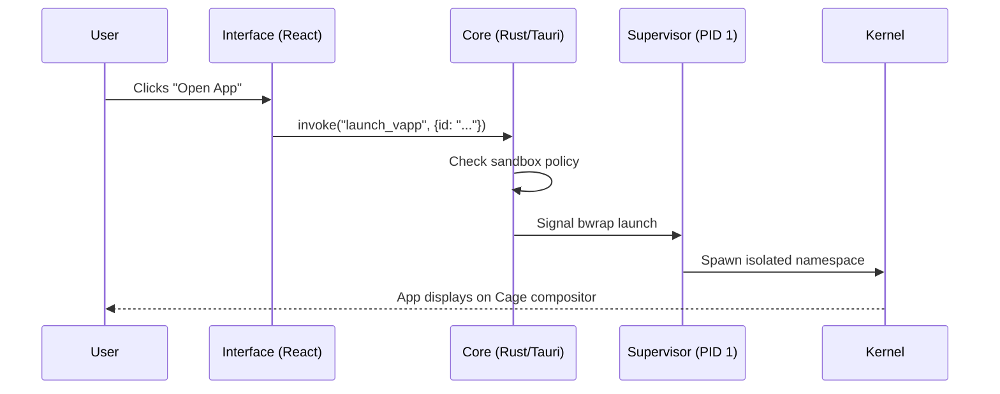

# 🤖 Magnolia OS: AI Agent Handbook

Welcome, Agent. This guide is optimized for your LLM context to help you navigate, build, and extend Magnolia OS with maximum efficiency and zero friction.

## 🧭 Project Architecture

Magnolia is a sovereign operating system built with a "Security-First" philosophy.

| Component | Responsibility | Tech Stack | Location |
| :--- | :--- | :--- | :--- |
| **Supervisor** | PID 1, Init, Mounting, Compositor Launch | Rust (No-Std/Hardened) | `/magnolia-supervisor` |
| **Core** | System Logic, HAL, AI Bridge, IPC | Rust / Tauri | `/magnolia-core` |
| **Interface** | Dashboard UI, App Store, Settings | React / TypeScript | `/magnolia-interface` |
| **Distro** | Image generation, Kernel config | Buildroot / BR2 | `/magnolia-distro` |

## 🛠 Building & Testing

### 1. The Orchestrator
Use `build.bat` at the root. It handles:
- Cross-compiling Rust binaries for `x86_64-unknown-linux-gnu`.
- Bundling React assets.
- Triggering Buildroot to generate `magnolia.img`.

### 2. Simulation
Use `qemu-test-win.bat` on Windows or `scripts/test_wsl_qemu.sh` to boot the image.
- **VGA**: VirtIO-GPU
- **Input**: VirtIO-Tablet (Absolute positioning)
- **Networking**: User-mode NAT

## 🧠 Intelligence Layer (`/intelligence`)

- **AGENTS.md**: Defines the behavior of the *Internal* Magnolia Assistant.
- **SOUL.md**: The philosophical foundation and design language (Floral/Premium).
- **TOOLS.md**: Capability map for the System Bridge.

## 📝 Rules for Development

1. **Rust 2024 Edition**: Ensure all new modules use the latest stable Rust patterns.
2. **Standardization**: All IPC between Interface and Core must use Tauri Commands with strictly typed JSON payloads.
3. **No-Home Policy**: Never add dependencies that perform telemetry or phone-home by default.
4. **Agent Readable**: Always update `HANDOFF.md` or this handbook after significant architectural shifts.

## 🧩 Component Interaction Map

---
*Magnolia OS: Sovereign by Design.*
